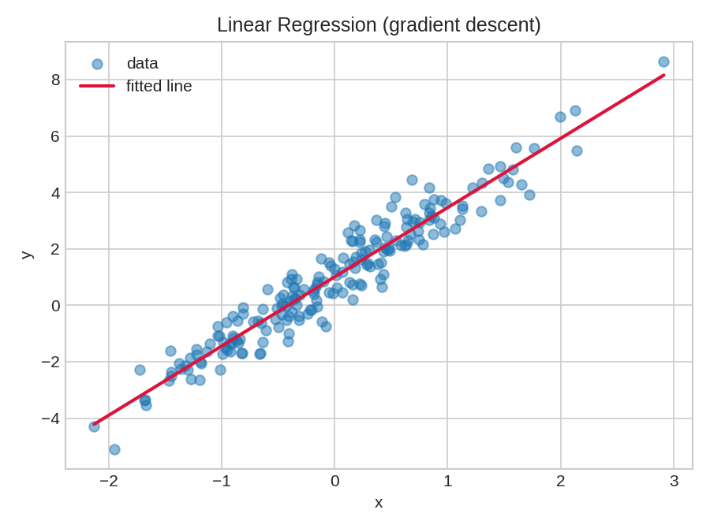
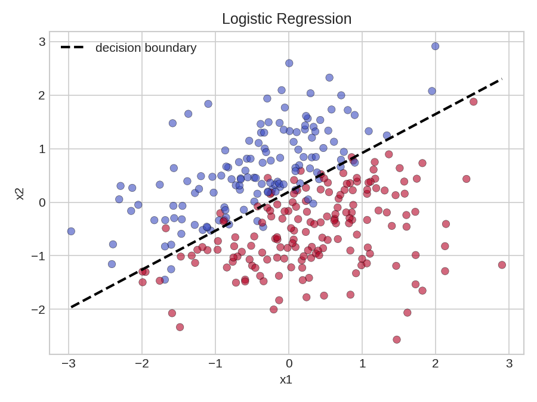
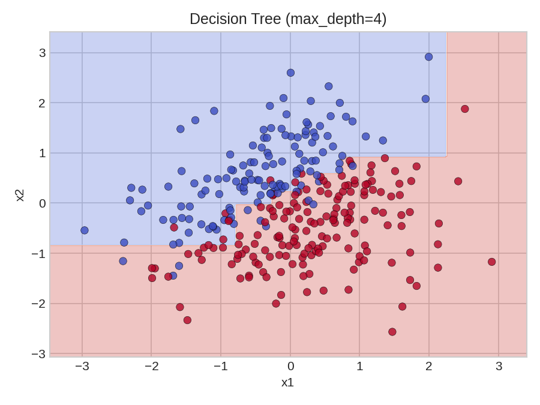

# GlassBoxML

[](https://github.com/Iskken/GlassBoxML/actions/workflows/tests.yml)


A from-scratch implementation of classic machine learning algorithms — no scikit-learn under the hood, just NumPy. Built for understanding how these models actually work: the math, the gradients, the splits.

## Algorithms

### Linear Regression
Closed-form (normal equations) and gradient descent solvers, with optional L1/L2 regularization.



### Logistic Regression
Gradient descent with a sigmoid decision function, optional L1/L2 regularization.



### Decision Tree
Gini-impurity splitting, recursive binary partitioning, configurable max depth.



Plots were generated with `python docs/generate_plots.py` — rerun it after changing a model to refresh them.

## Project layout

```
glassboxml/          Core package: models, losses, optimizers, metrics, data generators
tests/                pytest suite covering the package
experiments/          Exploratory scripts and notebooks, one folder per algorithm
webapp/               FastAPI + Chart.js demo - train a model and see it plotted in the browser
scripts/              build.sh / test.sh / run.sh - build, test, and run the Dockerized webapp
docs/                 README images and the script that generates them
k8s/                  Deployment/Service manifests for running the webapp on minikube
Dockerfile            Container image for the webapp
Jenkinsfile           Declarative pipeline: checkout -> install -> test -> docker build
.github/workflows/    GitHub Actions: test suite + Docker build on push/PR to main
```

## Installation

Requires Python 3.11+.

```bash
pip install -e .
```

## Usage

```python
import numpy as np
from glassboxml.models.linear_regression import LinearRegression
from glassboxml.data.generators import generate_regression_dataset

X, y, w_true, b_true = generate_regression_dataset(w_true=[2.5], b_true=1.0, n_samples=200)

model = LinearRegression()
model.fit_gradient_descent(X, y, epochs=500, learning_rate=0.1)
print(model.w, model.b)
```

More end-to-end examples, including regularization sweeps and decision-boundary plots, live in [experiments/](experiments/).

## Interactive webapp

A small FastAPI app lets you tweak parameters (sample size, noise, learning rate, tree depth) and watch each model fit live in the browser via Chart.js.

```bash
pip install -e . && pip install -r webapp/requirements.txt
uvicorn webapp.app:app --reload
```

Then open http://localhost:8000.

## Testing

```bash
pytest
# or
./scripts/test.sh
```

## Docker

```bash
./scripts/build.sh   # docker build -t glassboxml-webapp .
./scripts/run.sh      # docker run -p 8000:8000 glassboxml-webapp
```

## CI/CD

- **GitHub Actions** ([.github/workflows/tests.yml](.github/workflows/tests.yml)) runs the test suite and validates the Docker build on every push/PR to `main`.
- **Jenkinsfile** implements the same pipeline (checkout, install, test, Docker build) as a declarative Jenkins pipeline, for running the same checks outside GitHub Actions.

## Kubernetes

`k8s/deployment.yaml` and `k8s/service.yaml` deploy the containerized webapp to a local minikube cluster (NodePort service, since it's local-only). See the manifests for the exact image-loading step required before `kubectl apply`.

## License

MIT — see [LICENSE](LICENSE).
